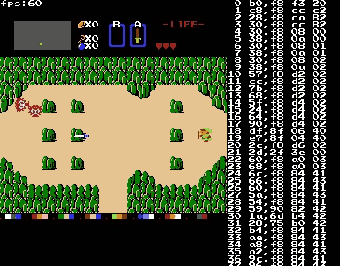
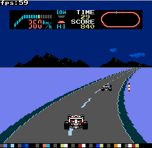
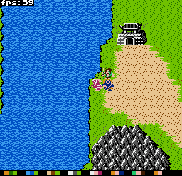

# Yet Another NES Emulator in Go



## Structure

```bash
.
├── core_src
│   └── nes
│       ├── apu
│       ├── cart
│       ├── color
│       ├── cpu
│       ├── mapper
│       ├── ppu
│       ├── sprite
│       └── tools
├── debugger_src  (deprecated)
├── emulator_src  (deprecated)
├── yanes_src
```

- **core_src** 
    - the core NES codes
- **yanes_src** 
    - NES emulator
    - UI: github.com/go-gl/glfw
    - Audio: github.com/gordonklaus/portaudio 
        - You must first install portaudio libraries
        - Ubuntu: `apt-get install portaudio19-dev`
        - MacOSX: `brew install portaudio`
        - On other systems you might have to install from source


## How to run 

```bash
cd yanes_src
go run *.go -p <path to your nes-rom>
```

```bash
  -h    print help
  -p string
        nes room path
  -s int
        scale (default 2)
```

- Shortcut keys
    - R : reset
    - T : dump name tables
    - P : screenshot

## TODO List

1. audio
    - triangle wave channel does not be implemented yet
    - DMA channel does not be implemented yet
2. mapper
    - mapper 2,3,66 have not been fully tested
    - add more mappers
3. improve performance in order to add more debugging features without decreasing fps


## Misc

[NES development notes](nes_notes.md)

## NES programming tricks

- F-1 Race
    - 
    - As a mapper-0 game, F-1 Race has only 8k character ROM. It actually hasn't any image for curve track.
    - The program puts the straight track in the name table. When the PPU rendering each scanline, CPU waits PPU until it entering horizontal blank, and then change the PPU register to set corresponding offsets for next scanline so as to display various curve track.
- Destiny of an empire 2
    - 
    - That animation of water is just swapping two palette colors alternately
    - a cheap solution, something like fragment shader used in nowadays games.


