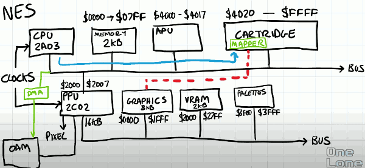

# NES Emulator #1 : Overview

## CPU 

Its designation  is 2A03 that is the type of chip that the CPU is made of.  It's actually a variant of what is called the 6502 which is very prolific in that area as the micro controller of choice.

It fact it is just a 6502. The only thing makes it different it is got inbuilt audio circuitry , which the 6502 didn't have. 

So for emulation , I'm going to just simply implement a 6502, because that gives me the opportunity to use it in other things in the future. 

### Memory

The CPU has no internal memory, so it must be connected to some bus.  Other things are connected to this bus.  Nes has a whopping 2k memory.

Fundamentally 6502 is an 8-bit device.  Its internal registers are only capoable of storing 8-bit information.  However it can address a 16-bit range, so potentially it could interface to a 64k memory.

In this bus, the memory is mapped to locations $0000-$07FF. So when the CPU puts an address  that lies within that range on the bus, the memory will response. 

Even though the CPU can address 64k of memory, most of those addresses will resolve to nothing. 

### APU

There could be other devices attached to the bus, for example, APU  which is the audio processing unit, responsible for generating the sound.  In reality the APU is actually part of the CPU, but conceptually it's more convenient to think of it in terms as being a separate peripheral attached to the bus. 

There are not many addresses mapped to the APU : $4000-$4017.

### Cartridge

The biggest one attached to the bus is the cartridge. It is the device that contains the memories that typically have the programs that the CPU runs. The cartridge may typically be mapped from $4020 to the end $FFFF.

So what we're starting to see already is we can't just represent the giant address space as an array. Depending on the address that the CPU is interested in reading or writing to , we need to respond differently. 

## PPU

There is an additional device connected to the bus, and it's the most important one , most complicated one -- PPU.

This only has a very small mapping given its importance and its relationship to the CPU , it address the range $2000-$2007.

The PPU is completely separate device.  The PPU is a completely separate device. It's official designation is 2C02. 

In many ways. you can think of the PPU as being one of the earliest graphics card. 

The CPU is not really responsible at all for drawing anything to the screen.  Instead, it structures the data within the PPU in such a way that PPU can compose a picture that we see on the screen.

As such , we can think of the PPU as being a parallel processing.  And it is a sophisticated device. It has a bus of its own.

Whereas  the CPU had 64k addressable range,  the PPU has 16k addressable range.  The PPU bus works in exactly the same way as the CPU bus. It has different things connected. 

### Graphics memory (mapping from cartridge)

Early on the bus, it has some memory mapped to graphics. This is the actually pixel data the sprites or the tiles that make up the scenes in game. There are 8k avaiable graphics memory.

However this memory doesn't necessarily exist on the NES. In fact it exists on the cartridge. 

### VRam 

The next component is a small VRam, a video memory , in total 2k.

VRam is used to store identifies that represent which tiles to draw in the background.  It is mapped to PPU  $2000-$27FF.

When we start talking about the PPU in detail later, we'll see that there's actually some additional complication to how this unit is addressed. 

### Palettes

The final unit connected to the PPU bus controls the palettes , it exist $3F00-$3FFF.

Unlike the graphics were familiar with today where things are stored as BMP, JPG, PNG, on NES it has its own format. All of the graphics on the NES were 2bits per pixel, and those 2 bits were indexed into a palette to choose all of the available colors that we saw on the screen. 

### Object Attribute Memory (OAM)

The PPU has one final additional thing connected to it  which is not available via any bus.  It a small memory called the object attribute memory. 

This memory is used to store the locations of the sprites that we see on the screen. 

The CPU effectively only 8 letter boxes($2000-$2007 ?) through which to deposit information and exchange information with the PPU. 

The Sprites and things moving around on the screen are clearly positioned by the CPU the PPU just does drawing , it doesn't implement any physics or movement. 

So the CPU need to populate this OAM memory every frame. 

The PPU is clocked at 3x frequency of the CPU. So the CPU updating the object attribute memory manully would be far too slow. So the NES provides a dedicated peripheral just for doing this and it's a primitive form of DMA, direct memory access, which temporarily suspends the transfer memory directly into the object attribute memory. 

This way the CPU can prepare a region of its own address space with where the sprites should be, but it doesn't need to bog itself down with manually transferring that information through this limited space. 

## Clocks

Feeding these devices are clocks. So everytime a clock ticks ,the CPU does something, or the PPU does something. In particularly the PPU every clock tick it outputs a pixel to the screen.

The CPU and PPU  acutally run at different speeds, and we'll go into that later. 

## Mapper

8k graphics doesn's sound like very much ...

The designers of NES knew that extending the capabilities of the NES would be vitally important to its success. They included additional circuit on the cartridges. The circuitry is called a **mapper**.

There are a whole host of different types of mappers. Most of nes games use just 3 or 4 different configurations of mapping circuit. 

**Mapper**  was responsible for what is known as Bank switching , and this is where the CPU can configure the mapper on the cartridge to give different data for the same address ranges. 
So for an instance,  let's say Bank A contains the graphics for level 1, when you reach level 2, the cartridge is programmed so that all the graphics map onto bank B, so you get different graphics for that level. And the nice thing is nothing has to be loaded or transacted along the bus. We're simply changing the mapping  of the addresses to different memory locations on the cartridge.  The CPU and PPU address those locations on their buses they see no difference, they don't know anything has changed , but the mapper delivers different data. 

Through this we can have significantly larger memories devoted to graphics and programs. 

 
