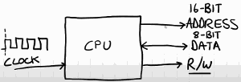
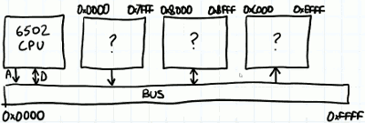
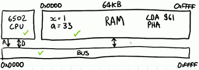
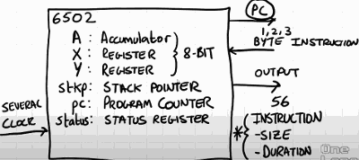
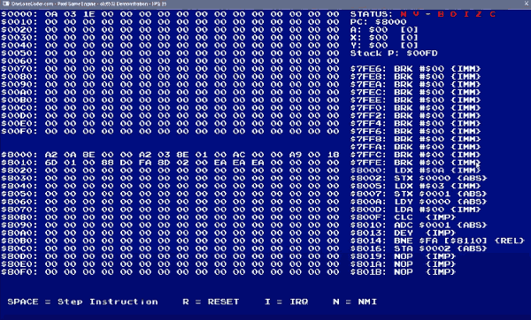

# NES Emulator #2: CPU

## 6502 CPU



CPU can output an address , and it can both read and write data. Data reading and writing shows the same inputs so additional signal is required to indicate whether it is reading or writing.

Finally in order to do anything at all, the CPU needs a clock.  Clock force the CPU the change state. On each one of these clock edges the CPU can evaluate if any data is on its input and respond accordingly to change its output. 

The CPU has no intrinsic understanding if the input data it sees is correct , if just responds to it. 

This raises a rather interesting philosophical point that you can't emulate the CPU in isolaton , we also have to emulate something else in its environment.

- The 6502 is capable of 
    - outputing a 16-bit address. 
    - exchanges data 8-bit at a time

Electrically the R/W signal is important , but in our software emulation we're not going to implement it as a signal.

---



Since the CPU on its own doesn't mean anything we need to connect it to something , a bus.

A bus is nothing more than a set of wires.  What connects to this bus are the address lines of the CPU.  Also connected to the use are the data lines. 

When the CPU sets the address of the bus, it expects all the devices connected to the bus to respond, either by putting some data on the bus themselves so the CPU can read it , or by accepting the data that the CPU itself has put on the bus, this direction is of couse  govened by the read/write signal.  So that means we need additional devices on this bus.

Here are 3 more devices I don't know what they are or what they do, but what I do know is that which device can only read , or only write, or both.  The Full addressable range of the bus is the full 16-bit , $0000-$FFFF.

Devices that are connected to the bus need to have an awareness of their place.  So let's say this 1st device only responds to addresses in the range $0000-$7FFF.  The 2nd responds to addresses in the range $8000-$BFFF , and the final 3rd device is sensitive from $C000-$EFFF.

When the CPU outputs the address 0x3000 on the bus,  the 1st devices is sensitive to it and will deposit some data on the bus, and that data can then be read back by the CPU.

If the CPU outputs the address 0x9000, and also write some data , let's say 0xAA.   The 2nd device responds, but because the CPU is writing , this device knows it's being written to.

Let's say the CPU finally wants to interact with 0xFF00, there's no connected device exists in that range. If the CPU is writing some data, nothing happens.  If the CPU is reading some data, then it effectively reading noise , or more likely it's reading the previous state of the bus.   Either way it's invalid data.  And if this scenario arises then the programmer has done something wrong because the CPU can't work in isolation , it's got to collaborate with other devices. 

Specifically for this video, I'm going to assume there is only one connected device. This device can be read and write to. And it covers the full addressable range $0000-$FFFF , and very simply it's going to be random acess memory RAM. 



In 6502 based system, RAM is very important. Effectively we have 64kb of it and not only it going to contain the variable information, it also contains the programs themselves.  Which is a fairly traditional von-Neumann architecture. This implies that most of the time the CPU is indeeded extracting bytes from the RAM in order to execute them as parts of its program, and periodically it reads and writes to different locations to act as temporary storage. 

We can see that even for a simple emulation, we need 3 components, the CPU, a bus, and something can provide the program, in this case the RAM. 


## Registers

- In 6502
    - there 3 core 8-bit registers in 6502
        1. A: accumulator
        2. X register
        3. Y register
    - SP: stack pointer, 8-bit
    - PC: program counter, 16-bit
        - store the address of the next program byte that the CPU needs to read
    - Status: status register, 8-bit



For our emulation we won't emulatie at the electrical circuit. 

- It will be lovely to think that each time the CPU is clocked, 
    1. it outputs its program counter on the address bus, 
    2. receives a single byte of instruction , 
    3. does some internal magic to perform computaion, 
        - and if necessary  output some data 

But **NO**. The 6502 does not operate this way. 

## Instructions 

- It has 2 components which have a high degree of variability 
    1. not all the instructions are the same length
        - some are 1 byte, some are 2 bytes, and some are 3 bytes
        - this means the PC is not simply incremented per instruction
        - and since we need to do multiple things in order to get the instruction  we're going to need several clock cycles. 
    2. different instructions take different numbers of clock cycles in order to execute. 

It means that per instruction we need to be concerned of the size of the instruction , and its duration. 

6502 has 56 legal instructions. These 56 instructions can be mutated to change their size and duration depending on the arguments of the instruction. Fortunately we can rely on the first byte of the instruction providing us with this information.  And we'll need this information in order to accurately emulate the instruction. 

```
LDA $41
```

In this instruction, I'm providing the data immediately. So it can read one byte of the instruction (LDA) , and 1 byte of the immediate data.  Therefore I can assume that this would be a 2-byte instruction. 

```
LDA $0105
```

Here it is a 16-bit operand , so it is a absolute memory address.  So it is  one byte (LDA) +  2 bytes($0105)  = 3-byte instruction.

```
CLC
```

CLC is a 1-byte instruction.

**Therefore, for given a instruction, we need emulate both its function and its addressing mode, as well as the cycles it takes to implement.**

INSTRUCTION -> FUNCTION + ADDRESS MODE + CYCLE

Fortunately , we can identify all of this information from the first byte. 

### INSTRUCTION SET OP CODE MATRIX

[6502 Instruction Set](https://www.masswerk.at/6502/6502_instruction_set.html)

Conveniently, we can represent the instructions in a 16x16 matrix.  The 1st byte we read can be used to index this table. The lower 4-bits represents the column, and the higher 4-bits represents the row. 

```
LDA  Load Accumulator with Memory

     M -> A                           N Z C I D V
                                      + + - - - -

     addressing    assembler    opc  bytes  cyles
     --------------------------------------------
     immidiate     LDA #oper     A9    2     2
     zeropage      LDA oper      A5    2     3
     zeropage,X    LDA oper,X    B5    2     4
     absolute      LDA oper      AD    3     4
     absolute,X    LDA oper,X    BD    3     4*
     absolute,Y    LDA oper,Y    B9    3     4*
     (indirect,X)  LDA (oper,X)  A1    2     6
     (indirect),Y  LDA (oper),Y  B1    2     5*
```

```
ADC  Add Memory to Accumulator with Carry

     addressing    assembler    opc  bytes  cyles
     --------------------------------------------
     absolute,Y    ADC oper,Y    79    3     4*
```

The ADC abs Y instruction is complex. `4*` means it potentially takes 4 clock cycles or 5, depends on where the data is being read from.

For those blank entry in this table,  if CPU meet such instruction, an illegal opcode, CPU will still do something, but it was not something the designers intended to happen. 

There is a reason that CPU takes multiple clock cycles to implement instructions. In effect they run tiny little programs of their own internally and each stage of that tiny little program requires its own clock cycle. 

---

The sequences of event is as follows . We're going to 

1. READ byte @PC
    - read a byte at the PC's location
2. OPCODE[byte] -> A 
    - use this byte to index an array which represents the big table to get me 
        - the addressing mode 
        - and the number of cycles
3. READ 0,1, OR 2,  MORE BYTES
    - once I know the addressing mode I'm going to read any additional bytes that I need to complete the instruction
4. EXECUTE
    - then I'm going to execute the instruction 
5. WAIT, COUNT CYCLES, COMPLETE
    - for my emulator I'm then going to wait and count clock cycles until the instruction is officially complete. 


## How to test your CPU emulator ?

- disassemble
    - look at a specific range of addresses and turn the binary code into a human readable code.
    - this is invaluable for debugging as it allows you to step through the code and really see what going on. 
    - It's leveraging the address mode functions in order to decode the code in right order. 
    - fundamentally it retains a container of strings that represent the decompiled program. 
- now it's time to see if the emulation works. 
    - to test the emulation of CPU, I've created a small pixel game engine project just help visualize what's going on.  If purely visualizes the state of the CPU. 
    - 
    ```cpp
    #include "olcPixelGameEngine.h"
    ```
    - overwrite
        - `OnUserCreate`
        - `OnUserUpdate` , and response user input
            - spacebar , it's going to provide enough clocks until that particular instruction is complete. 
            - R, I, N keys to reset, irq, nmi
    - 

- assembler : https://www.masswerk.at/6502/assembler.html
- testing ROMs
    - http://wiki.nesdev.com/w/index.php/Emulator_tests
    - one of the easiest to ues tests for the CPU is nestest , by kevtris
        - [doc](http://www.qmtpro.com/~nes/misc/nestest.txt)


