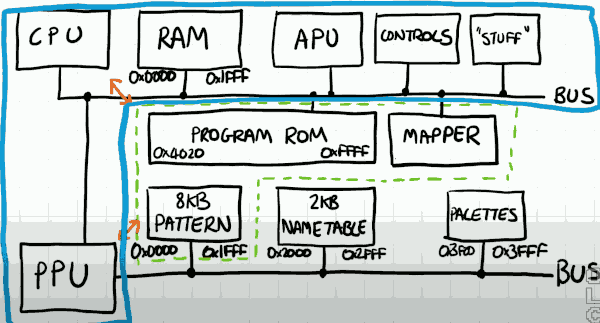
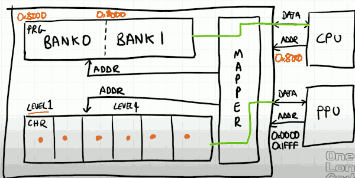

# BUS, RAM, ROMS, MAPPER

## RAM

- On Nes, there is not 64k of RAM though, in fact only 2k RAM that is accessible in range 0x0000-0x1FFF (8k)
    - but how can that 8k range be mapped on to the 2k RAM?
    - Nes uses something called mirroring. 
    - ram_addr_2k = ram_addr_8k & 0x07FF

## PPU

- PPU has its own bus, attached to this bus is an 8k addressable range that reflects the pattern memory. This is the memory that stores what the graphics looks like.  0x0000-0x1FFF
    - There is an additional dedicated Ram here  , stores the name tables, effectively 2D arrays which store index of patterns to show in backgroud.  0x2000 ~ 0x2FFF
    - Finally the PPU has a small RAM attached to it which stores the pallet information, which describes which colors should be displayed on the screen when you combine the sprites and backgroud. 0x3F00-0x3FFF.

## Cartridge

- The program Rom is addressed via the CPU bus, and basically fills up the entire seconds half range of the CPUs addressable range.
    - The Cartridge doesn't just contain the program. It also contains all of the graphical information required.
        - So the pattern tables are also stored on the cartridge. 
- For simplicity, I'm going to assume that name tables are stored on the Nintendo system itself.
    - This isn't strictly true. Certainly there is a 2k RAM available to store name tables, but some cartridges extends the feature set of the PPU bus and some of the name table can be stored on the cartridge.

- Sometimes the amount of program data required exceeds the addressable range of the CPU.  So different banks of the cartridge ROMs need to be connected to CPU bus as required. 
    - This is handled by mapping circuit which exists on the cartridge. 
    - mappers are typically addressed in the same range as the program ROM. Because ROMs are only be read from but the mapper can be written to. And since the bus is capable of differentiating reads from writes we can split the CPU's intent accordingly to either reading an instruction or some data from the ROM or configuring the mapping circuit.

- One thing to note is that all of this stuff in the middle here on the cartridge can be read / written by CPU and PPU. 
- Our existing bus class is really going to representing what the Nes is. 
    - So the bus mutate into being a representation of the console.
- Even though PPU has its own bus, a much simpler bus, so PPU will contain internal the things that it needs. 

## Mapper 

- Cartridge may consist of many different memories and physically different memory chips,  or it may consist of one large memory but only reference sections of it at a time. 
- It is the job of mapper to take the incoming adresses from both buses , and transform them to the correct memory location on the cartridge. 
    - This way, the CPU/PPU is oblivious to the data that it's reading or writing. 
- Large memories may be split into banks. the CPU is addressing 0x8000, the mapper takes that 0x8000 and converts it into a suitable address to read from this ROM.  The CPU will have pre-configured the mapper choose which bank represents that address range. 

- **The CPU comfigures the mapper, and the mapper translates the addresses.**

