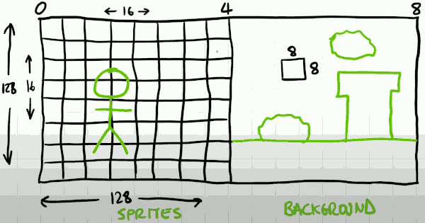
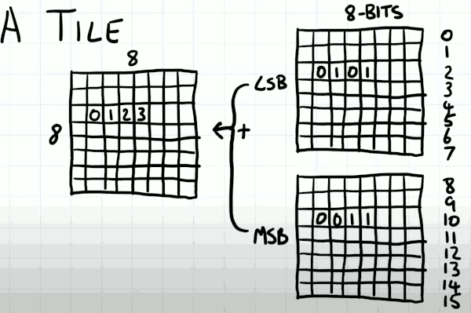
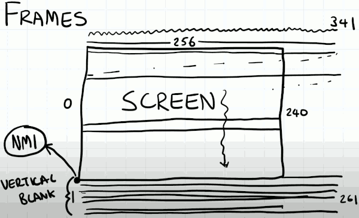
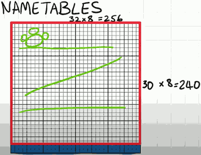
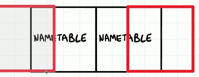
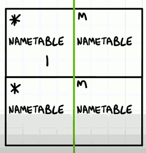
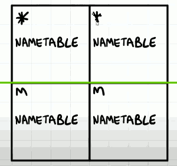
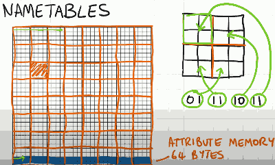
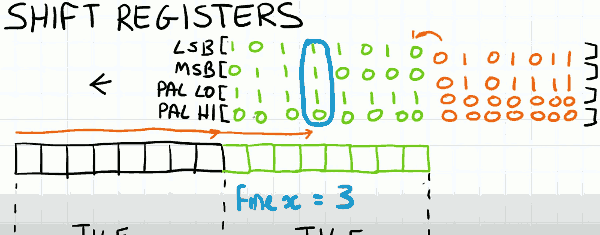

# PPU

- PPU access to 3 memories on its address bus
    1. 8K CHR ROM (it can be RAM...)
        - sprites 
    2. 2K name table, VRAM
        - layout of backgroud
    3. Palette memory  , decide which colors are displayed on the screen
        - colors

## PATTERN MEMORY (CHR)

- The 8k pattern memory can be broadly split into two 4k sections. 
- Each sections is splite into a 16x16 grid of sprites
- A sprite can also be referred to as a tile. And the tile itself is 8x8 pixels
    - if we viewed this as an image, it is a 128x128 image.
- The PPU has the ability to select between the left hand side of this memory or the right hand side of this memory to access the source for its drawing.

- Assuming the pattern memory lies solely on the cartridge, we have to go via the mapper to access it. So the mapper has the ability to selectively swap out sections giving access to different sprites (yellow line).  And in fact this is how many sprites are animated on NES. 

- It's quite common to see this memory split that 1/2 handles sprites, and the other half handles backgroud tiles.

## TILE

- The tile is 8x8 bit map.  NES only use 2 bits per pixel. 
    - So it gives you a choice of 4 colors per pixel
- And it stores the tile in the following and quite convenient way. 
    - MSB + LSB
    - The tile in memory is stored as the entire LSB plane followed by the entire MSB plane. 
        - Implying that it takes 16 bytes to store an entire tile: 8LSB+8MSB
- For reasons which will become more apparent a litter later , pixel values of 0 can be considered transparent. 

The 2 bits of the tile is not enough to specify its color , we need to combine it with a palette. 

## PALETTES

- The pallete memory is structured in the following way.
    - $3F00 we have a single entry for the backgroud color, it is the index of 64 NES available colors 
- each 4 bytes is a palette,  the 0 entry is all mirrors the backgroud color address. 
    - this clever architecture means that no matter what palette you have selected for you particular drawing , you get an effective color from the background, which can make your drawing looks transparent. 
- The first 4 palette is used for background, the next 4 paletter is used for foreground palettes.

## Registers 0x2000-0x2007

- 0x2000
    - The **CONTROL** register
    - this is responsible for configuring the PPU to render in different ways
- 0x2001
    - **MASK** register
    - this decides whether backgrounds or sprites are being drawn and what's happening at the edges of the screen. 
- 0x2002
    - **STATUS** register
    - is important for telling us when it's safe to render

- 0x2005
    - **SCROLL** register
- 0x2006 (**ADDR**), 0x2007 (**DATA**)
    - allows the CPU to directly read and write to the PPU's memory address and data.

- The full addressable range of PPU is 14 bits, but the CPU can only transfer 8bits during a write. 
    - So it has to do 2 successive writes to set the address. 
    - the 1st 8 bits set the high byte of the address, then the low byte

## Frames 

- Scanline represent the horizontal rows across the screen.
    - Th scanline can exceed the NES dimensions (256x240)
- As the scanline is going across it's counting cycles and we crudely estimated that 1 cycle was equivalent 1 pixel along the scanline.
    - there are 341 cycles per scanline
    - once it gets to the end of the scanline, the gun would switch off and go back to the next one, and it would keep doing this all the way down the screen through the visible area , the 240 visible scan line. 
    - but it doesn't stop. in total there are 261 scanlines 
    - **The bottom unseen scanlines** is known as the **vertical blanking period**. and it is important that the game knows when this period starts. 

- if while the scanline is being drawn across screen and the CPU starts to talk to the PPU, it could inadvertenly cause all sorts of graphical artifacts on the screen. 
    - In some advanced scenarios this is in fact exploited. Buf for simple use case it would generate noise. It just wouldn't look very nice. 
- So it's important that the CPU knows it can do some processing while the screen is updating  but it can't really change the nature of the PPU 
    - however of course the CPU can change the nature of the PPU once the vertical blank period has started.
    - So it is typically during this peirod that CPU is setting up the PPU ready for next frame. 

- For our emulation purposes, we're going to assume that once we've got to the last scanline, we don't jump back to scanline #0, instead we put in a conceptual scanline-1. 
    - So the vertical blank bit in status register tells us whether we're in screen space or nothingness space we can mess things up
- We can also optionally emit an interrupt request to the CPU at this point too. 
    - This uses the non-maskable interrupt feature of 6502.  Whether or not we emit this interrupt  is govrned by a bit of the control register. 
- Combinations of the vertical blank bit and the non-maskable interrupt are used for synchronizing the the PPU with the CPU so that things on the screen look normal. 
    - It's important that the CPU finished doing whatever it's doing while the screen is being rendered , otherwise we'll get lag and the CPU may have to wait an entire frame before the screen is updated. 

## NAME TABLES

- The backgroud of NES game are stored in a name table, in the name table memory.
- 
- Here we have a name table, 32x32=1024 , 1k bytes
    - each byte represents an ID into the pattern memory , 16x16 tiles
    - so there are 256 possible tiles to place in a single name table location. 
- Since NES only has 240 vertical resolution,  not all of the rows of name table are used.
    - In fact the bottom 2 rows are used for something else.

### Scrolling

- To facilitate scrolling the NES actually stores 2 name tables, and they lie next to each other in the memory.
- As the viewalbe area of the screen scrolls across it, it acrosses this boundary and we render from two different name tables simultaneously. 
- The CPU is tasked with updating the invisible parts of the name table. 
- 

- The NES itself has memory for just 2 name tables, so that's 2k.
    - but by utilizing address mirroring we can conceptually have 4 name tables. 
        1. horizontal mirroring 
            - 
            - for games scrolling vertically
        2. vertical mirroring
            - 
            - for game scrolling horizontally , like mario brother
- The configuration of the name table mirroring can come from a variety of sources. 
    - On some cartridges like SuperMario Brothers, it's hard coded into the cartridge circuit.
        - and that means the entirety of SMB is limited to scrolling horizontally.
    - Some mapping circuits can also dedicate how mirroring is implemented , and can dynamically switch between the two depending on what's required.
        - like Zelda you scrolling in both directions
    - In SMB3, you can see scorlling in both directions simultaneously.

### Backgroud palette

- Now we know which tile we want to display from our pattern memory for a particular location on a name table, but we've not specifed which palette.
    - it's the bottom 2 rows of the name table.  These 64 bytes is called **arribute memory**.
    - each byte is responsible for a region of the name table , a 4x4 cell region,  each 2 bits is responsible for a 2x2 grid
    - 
        - lower bit 0,1  is responsible for the top-left 2x2 grid
        - 4 tile shared by a palette

## NTSC PPU Frame

[PPU Frame doc](http://wiki.nesdev.com/w/images/4/4f/Ppu.svg)

- The first 8 cycles reprsents one row of one tile. 
- The PPu is only capable of storing information for the next tile it's going to render. So during those 8 cycles it's loading up the information it requires for the next 8 pixels
    - In this case, its loads the name table byte (NT byte). 
    - Then it loads the attribute byte (AT byte) that contains the palette information.
    - Then it loads the pattern itself (BT tile byte)
- Once the 8 pixels has been drawn, we effectively move to the next tile ( the red cell).
    - And repeat the process. 
- At those cycle 329-336, what we do need do is to prepare data for the next rows. 
    - this is also why our scanline start with -1.
- loopy 
    - quite a convenient memory structure for representing this information. 
    - this is an internal address maintained by the PPU that correlates the scanline position to well everything else that's going on.  and it always maintained by the PPU itself.  In fact this is the reason why you can't write to the PPU while it's rendering. 
- [nesDev way](http://wiki.nesdev.com/w/index.php/PPU_scrolling)
    - Unsurprisingly the nesDev wiki promotes the use of using loopy's approach too. 
    - And it's quit verbose in telling us when and how the loopy registers are updated. 
- 2 Registers are maintained. 
    - 1 is labled V , which is the internal data register that the PPU is incrementing as required to get the data. 
    - the other 1 is called T, and this is the one that gets affected by the user.
        - So when the user reads and writes to the PPU. This is the register that is updated. 
    - periodically parts of V , need to be updated with the contents of T.
        - things like facilitating the reset at the end of a scanline to go back to a known localtion.- These registers combine the scrolling information as wellas the PPU's location in order ot access the right bytes of memory.
- All of the cycles marked in red imply that we're doing some additional manipulation of the loopy registers. And there are 4 essential functions 
    1. incrementing in x-direction
    2. incrementing in y-direction
    3. resetting x-axis
    4. resetting y-axis

## 

- Now we know how to get the data to render the next 8 pixels.  Those data will be buffered for the coming rendering.
    - but when starting rendering those 8 pixels, how to store the pre-loading data for later pixels ?
- It is a slightly parallel part of the PPU.  The NES utilizes **shift registers** in order to do this.

- Here we have a row of 16 pixels on a single scanline. 
    - while the scanline is rendering these pixels, it's loading up the information for the next 8 pixels.
    - these information is loaded into the low byte of a 16 bit shift register.
    - every cycle , therefore every pixle, the shift register shift to left.
- so by the time we get to this tile boundary the bit information for next 8 pixles is in the high byte of the 16-bit.
    - normally we choose the most significant bits of the shift registers to render that pixel
    - when I move to the next pixel , both of these registers are shifted 1, so again I can take the most significant bits 
- However there is something else that affects this value, and that is our fine_x position we set via the scroll register.
    - Everything so far has happended at tile boundaries but we want pixel precision for our scrolling.
    - So in stead of choosing the most significant bit all of the time, we choose the bit chosen by the fine_x register.
    - So supposing our fine_x is 3, then instead of the most significant bit we choose 3 from the most significant bit.  this is effectively scrolled our tile by 3 pixel.
- The palettes were only represented as 2 bits but they apply to the whole row.
    - So when load in the palette attribute information , I'm going to set all the bits to be the same, in that way I can use exactly the same mechanism to choose all of the information I need. 
- As the scanline continues through the pixels we're rendering , in the backgroud we're loading up the information for the next 8 pixels. 
    - So we end up with this never-endding stream of 1 bit information to give us a very smooth scroll in the x-direction, but also supply us with the information of the color.

