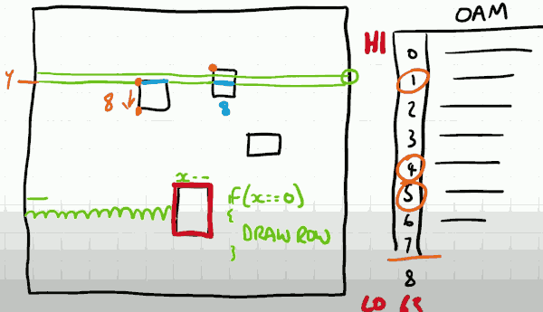
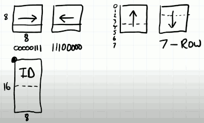
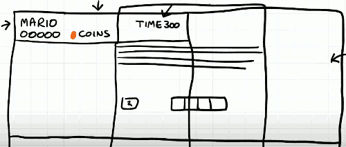

# 5 PPU Foreground Rendering

## CONTROLLER INPUT

- The 8 switches that represent the buttons are fed into a PISO which stands for parallel in serial out. 
    - The PISO get a single signal going into the console. 
- The controller are memory mapped to the CPU address bus. 
- When the CPU writes to that location it instructs the PISO to store the current state of 8 switches.
    - It doesn't matter which buttons the user presses now until the CPU writes to that address again at that pointing time the register inside this PISO is storing that state.
- When the CPU reads from the memory map to address for this controller , it doesn't read the whole 8 bits instead it reads just the most significant bit.
    - and after it's read that bit, all of the other bits shift along 1. 
    - this is how we can go from our parallel in to our serial out.
- This internal structure is otherwise known as a shift register. 
    - so to fully read the state of the controller at any point in time the CPU must write to the memory mapped register and then read from it 8 times to get all of the button information.

- By default, NES has 2 controller, and these are mapped to addresses $4016,$4017.

## SPRITES

- To represent a sprite , we need
    - x coordinate
    - y coordinate
    - tile id
    - attributes
        - priority, palette, and orientation(the most complex 1)
- where does those information be stored?
    - Sprites are stored in their own internal memory of the PPU , the OAM -- OBJECT ATTRIBUTE MEMORY.
    - A special 256 bytes of storage exclusive to the internals of the PPU. It is not accessable directly via the PPU bus. 
    - THe sprite information requires 4 bytes to store which implies that the OAM can store 64 sprites. 
- PPU supports 2 sprite modes 
    - one of which is 8x8
    - the other one is 8x16, so the tiles are technically twice as high. 
    - Interestingly even though these dimensions are different, the approach to handling and rendering sprites remains the same.

- CPU use the OAM address register and OAM data register  to access the OAM memory whinin the PPU.
    - since OAM has only 256 bytes, so it only need 1 byte of addressing informations
- So the CPU can simply populate the address and then write the data to it. 
    - and similarly we can read from the OEM memory too
    - so to fully polulate the OAM memory, the CPU would need to write 256 addresses and write 256 items of data and that's terribly SLOW !
- Most games do not use these ports. Instead the CPU talks to the PPU via this mythical 9th register , and this register can only be written to and it lies at address $4014.
    - and when the CPu writes to this address, it starts a secondary process of what is known as direct memory access DMA. 
    - the CPU can write the address of a start of a page of memory in CPU address space, what happens next is quite strange: upon detecting that register $4014 has been written to, the CPU is suspended, it's not an interrupt, it doesn't wait for the current instruction to finish , it just stops. At this point DMA kicks in for the subsequent 512 clock cycles.
    - After these 256 cycles read and 256 cycles write, the CPU is allowed to continue its work. 
    - This approach is 4 times fast.

----

### How does the PPU render the sprite ?

- once we reach the end of the **visible** portion of the scanline, we work out which sprites are going to be visible on the next scanline.
- for a perfect emulation. per scanline, the NES is really only capable of drawing 8 sprites even though there is 64 to choose from. 
- however more than 8 might exist on that scanline , in this case we end up with what's called a sprite overflow, and there's a specific bit to set in the status regester of the PPU.
- now there's a little bug surrounding that particular bit and I've not implemented it true to form. Nonetheless if there are more than 8 sprites chosen for a scaline I'm setting that bit. 
- Once we've got our maximum of 8 sprites you'll notice we don't actually need the whole sprite , we only need the row of sprite.  Therefore we need to extract the correct sequence of bits for that row of the sprite. And we can store up to 8 those bit sequences.
- WHen we're drawing these sprites they get shifted in much the same way that the background tiles were except there's not fine_x offset.
- Then how do we know when to start rendering the sprite without find_x offset ? Quite elegantly as we're cycling along the scanline we can simultaneously be reeducing the x-coordinate by 1, therefore when we know that this x-coordinate is 0, the scaline has reached the start of sprite. This approach means we don't need additional variables.
- What do we do if we've got 2 sprites that overlap? Which one do we draw? The NES assumes the priority order based on the sprites location in OAM. 
    - So the sprite at the 0 entry of OAM has the highest priority and the one at 63 has the lowest priority. 
    - and we'll see when we start implementing this there is some priority resolution  depending on the transparency of the particular pixel. 

- RECAP: 
    1. end of scanline, search OAM for max of 8 sprites visible on next scanline
    2. as scanline scans, reduce sprites x coord , for those extracted visible sprite.
    3. if x coord == 0. start to draw sprites.
    4. resolve priority of sprite pixel , which pixel is visible

## SPRITE ORIENTATION

- flipx
    - just flipping the row bits
- flipy
    - manipulate the pattern memory address slightly ,  7-row

## HITTING SPRITE ZERO

- When peole implement games , one of the most challenging aspectes is implementing something called collision detection. How do we know when one object in the game would has collided with something else?
- NES provides a single flag that represents whether a sprite overlaps with a background tile. And it only does this for one sprite, this sprite 0 in our OAM memory. 
- Why this is useful?
    - It's used as a way of synchronizing the CPU with the PPU. 
    - We know that we can synchronize with a vertical blank flag. That's fine.  But it doesn't tell use how far down the screen, i.e. which scanline we're up to. 
    - Sprite 0 allows us to perform a very simple check.

- We saw on the pattern table that we had a unique sprite that represented the bottom of this coin.
    - and we know that this sprite was located at sprite 0. 
    - In this situation this triggers a flag in the status register.  This is called a **sprite zero hit**.
    - And the CPU can periodically examine the status of the sprite zero hit flag, and get an indication of how far down the screen. 
- So somethings, when we scrolling our bg, but we don't want to scroll top menu part. In this case the sprite 0 hit is very useful to help us to determine which part of name table should or should not scroll.
    - This is probably the most common use of this sprite zero hit. 

