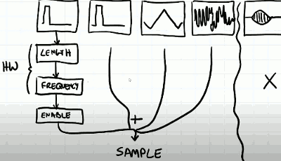
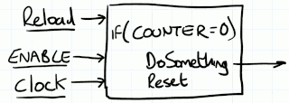
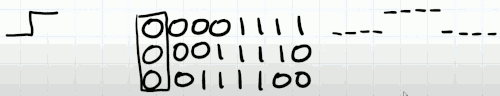

# 6 Sound

[wiki APU](https://www.nesdev.org/wiki/APU)

We can't just issue sound samples to some audio device in game loop, because the rate at which we issue the sound samples is won't be consistent.

Instead samples must be generated at the rate the audio device expects. 

The sound player need to maintain a thread, and the speed at which this thread operates is largely governed by the sample rate that we specified when we create our sound player. In this way we can ensure that sound samples are delivered to the audio device hardware appropriately.

To get the samples that we need, the sound player is going to request from the main thread  a sample of sound when it needs it , and the main app thread will then return that single sample.  This request is going to interrupt our main thread.

## NES APU

The NES can generate sound from 5 different sources. These different sources fundamentally can be considered different types of oscillator. 

It has 2 pulse wave channels. They can generate a pulse square wave with different duty cycles.  These 2 channels are typically for the melody lines and sound effects.

The 3rd channel is a triangle wave channel, it is used to give you a more bassy like sound.

The 4th channel is a noise channel, this gives you percussive instrument sounds, or explosions.

Finally , there is a sample playing channel , this plays what is a very simple waveform , for example, it might be somebody saying "well done", or "level complete".

---

On the hardware, the NES is also capable of specifying the duration of a note, and its length, and its frequency.  Not all of the channels have the same set of parameters. 

So for a specific channel, once the waveform is generated, it associated with a length, which is how long is it played for. And for the pulse wave channels it can also be swept. That means it's frequency is changed in real time. If the frequency is changed, then NES will automatically increases or decreases the frequency over time.  Both of these are controlled with dedicated hardware. 

We also have the ability to enable or disable the channel. These pathways per channel ultimately becomes summed to give us our final output sample.  But the final waveform playing channel is not going to be considered for the time being.

The APU has addresses mapped into the CPU address bus. 

---

The APU is really a fire-and-forget device we just throw data at it and it acts completely independently to everything else that the NES is doing. 

## SEQUENCER

The heart of each NES audio channle lies something called a sequencer. Fundamentally a sequencer is just a counter that countdown , and only countdown when the sequence is enabled and it is clocked. 

If the counter becomes 0, then we do something, and then we reset the counter to some known value. 

What the sequencer actually does is different per channel. 

Let's assume I have an 8-bit word, 00001111. We could consider this word to be a 50% duty cycle square wave. It's low and then it goes high.  We can configure our do-something function to rotate this word --> 00011110 and again.

If we always output a specific bit each time those are do-something over times, what we'll see is a sqaure waveform. 

If we increase the clock rate or decrease the counter reload value, we effectively change the period between the do something functions. In effect we have changed the frequency of this square wave output. Therefore with this very simple approach we can generate different duty cycles pulse waves at different frequency. 

The sequencer for the pulse wave channel really does two things at once , it sets the frequency and duty cycle. 

