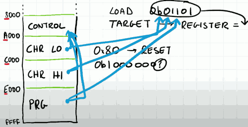
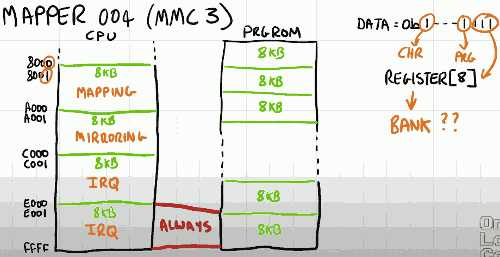
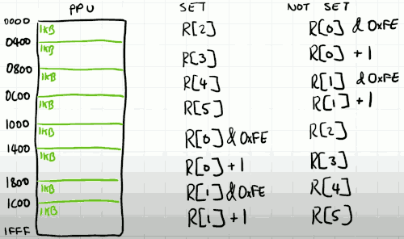
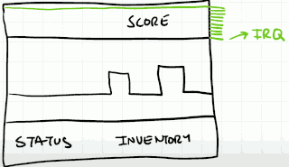

# Mapper

Swapping the entire address space ($8000-$FFFF) in one go is a bad idea.  This is because as the program is running. 

There is a great risk in just swapping the memory out  as the PC will start in the exact same location in the new bank of memory, which makes things quite complicated.

Instead there is a different solution. It's convenient to think of program ROM in 16k chunks, and equally think of the program memory location in the CPU address space also in 16k. ($8000-$BFFF, $C000-$FFFF)

The the PC is operation in one 16k range, it can config the mapper to change the bank reference in another 16k range without corrupting the program. 

The chunk size here , 16k,  is chosen somewhat arbitrary and we'll see that the different mappers handle things in different ways. 


---

The address space of the PPU is mapped in a pretty much identical way.The address space is of course smaller. 

The 1st halff (8k) which is used to store the sprite patterns. This regoin gets mapped onto the character ROM. The character ROM can be partitioned in many ways. and different regions of the pattern tables can be mapped onto different banks of the character ROM. Typically these regions are considerably smaller.  The mapping of the PPU is a lot more flexible than th CPU because PPU has on PC.


---

The mappers take advantage of the fact that the program memory is a ROM, it's readonly. We can write to these locations, but nothing happens.

The CPU bus is unware what ROM means so it quite happily write to a location. The mapper will receive this address and data, but the data simply has nowhere to go. Therefore if the mapper detects an address which is in the range where the program is expected to be read from , it can interpret that address as a command to the mapper itself. And it's through this mechanism that we can configure the mapper to set up the mapping.


Some of the mappers rely on knowing how many program banks and character banks there are. 

---

## Mapper 002

- PRG ROM capacity: 256k/4096k
    - PRG ROM aren't just the executable code they can also be all of the level data and sometimes graphical positioning data that make up the game. 
- PRG ROM windows: 16k + 16k fixed
    - the 2nd 16k is fixed. so this will always be mapped to a specific location in the ROM. for mapper 2, it always mapper the last 16k of ROM.
    - this is a useful utility to have because you could leave all of your system critical functions and startup code in this fixed region. 

- CHR capacity: 8K
- CHR windows: n/a

### Registers

- concept: the mapper has registers !!
- mapper 2 has only 1 register , and we can write to that register by writing to any word in ($8000-$FFFF)

```
Bank select ($8000-$FFFF)

7  bit  0
---- ----
xxxx pPPP
     ||||
     ++++- Select 16 KB PRG ROM bank for CPU $8000-$BFFF
          (UNROM uses bits 2-0; UOROM uses bits 3-0)
```

## Mapper 003

- PRG ROM capacity 16k or 32k
- PRG ROM window n/a
- PRG RAM capacity None
- CHR capacity 32k (2M oversize version)
- CHR window 8k

## Mapper 066

- PRG ROM capacity 128k, 512k oversize
- PRG ROM window 32k
    - it make sense when you have multiple games on one cartridge
    - for example, smb on 32k, dunkong king on 32k , etc
- CHR capacity 32k , 128 oversize
- CHR window 8k


## MAPPER 1  (MMC 1)

- PRG ROM capacity 256/512k
- PRG ROM window : 16k+16k fixed,  or 32k
- PRG RAM capacity 32k
    - in effect we can enhance the amout of RAM that the NES has.
    - perform its calculations or store data
    - and save game if it has some battery backup
- PRG RAM window 8k  // 8k mapping
- CHR capacity 128k
- CHR window 4k+4k, or 8k
- Nametable mirroring H,V,or 1, switchable
    - software programmable

### Register 



- you communicate with it serially
- in big picture , MMC 1 contain 2 registers
    1. LOAD
    2. TARGET
- when the CPU writes to $8000~$FFFF
    - if   data & 0x80 != 0 , then the mapper is reset.
    - in all of the circumstances the mapper is only interested in the bottom bit of data. It takes 5 writes to anywhere within this range , and serially shifting in just that bottom bit into LOAD register.
- once the LOAD register has been populated with 5 bits something is going to happend , depends on which adress was used by the CPU.
    - by only looking at the CPU address bits 14th,13th, we can break the instruction region ($8000-$FFFF) into 4 8k zone. 
    - when the 5th bit has been loaded serially and in combination with the address zone (0~3), we can target one of 4 functional registers.
    - in the 1st zone we have the CONTROL register, which used to set various status bits on the mapper and also the mirroring mode.
    - the next 2 zones are used to set information for the mapper to mapper the character ROM.
    - and the final zone is used to config the mapper for the program ROM. 

- CHR LO, CHR HI, PRG registers they each use information from the CONTROL register and information from the data of LOAD register.


## Mapper 4 (MMC 3)

- PRG ROM capacity 512k
- PRG ROM windows 8k+8k + 16k fixed
    - 2 flexible 8k , and 1 fixed 16k
    - in implementation, it is convenient to think of it as just 4 8k chunks. 
- PRG RAM capacity 8k
- PRG RAM window 8k
- CHR capacity  25k
- CHR window  2k*2 + 1k*4
    - implementing it in 8 x 1k chunks
- Nametable mirroring : H or V, switchable, or 4 fixed
    - software programmable
- IRQ : Yes
    - NEW !

- Writing to any address $8000 or above and depending on the address and the data , we set specific internal registers on the mapping chip. 



- So I split my program memory into 4 * 8k chunks. 
    - the final 8k chunk is always mapped to the last 8k bank on the PRG ROM. 
- Fortunately this time we don't need to concern ourselves with serialized behavior , we can write to specific addresses and it turns out just as before there is 4 distinct zones we set specific registers.  but each one of those zones is split into an odd and even , and the numbers are mirrored throughout the zone. 
    - the 1st zone handle mapping
    - 2nd mirroring
    - 3rd IRQ
    - 4th  IRQ
- In the mapping zone, 
    - when even addresses are used, we're configuring the mapper with how to configure the mapper.  Sounds a bit strange...
        - we're configuring the state of the mapper, we're also preparing it for future data to come.
    - when use odd addresses, we're actually providing the data for the actual mapping itself, the addresses in the program ROM. 
        - the data is written into the corresponding register, given the index we've just received from the previous write to an even address.
    - There 8 registers identify which Bank we want to use. 

- if data & 0x08 != 0 , 
    - then the 1st chunk is directly mapped to the 2nd-to-last bank of PRG ROM.
    - the 3rd chunk is directly mapped to the bank identified by registers[6]
        - this implements the fixed 16k mapping
        - 
- if data & 0x08 == 0 , 
    - 1st , 3rd chunk swap around
- regardless of whether the bit up there is set, the 2nd chunk is mapped to the bank identified by registers[7]

---

- The character mapping happens the same way.
- 

---

- IRQ: mapper generates an interrupt requset for the CPU.
    - used to inform the CPU that it had finished rendering a frame and therefore the game loop could go ahead and get the intput to do some calculations and produce the output for the next frame.

- In many games it's useful to split your screen into different regions particulary if you've got status bars.
- 
- How does the PPU handles split screen scrolling? 
    - in games like mario 1, as the scanline is zipping across the screen , it waits for a specific pixel to be hit , and that issues a sprite hit event to the cpu. and the cpu can use this to crudely measure where the rasterizer is ought to, and use this information to change its rendering information accordingly. 
    - the problem is per frame you only get to do this once.
- A slightly more elegant solution would be to have some peripheral system to count the scanline.  and when that count of scanlines hits a particular number you've programmed in advance you can issus an interrupt to the CPU , and this provides a much cleaner and predictable solution.
    - The only problem is there's nothing on NES that will do this. 
    - so this functionality has been added to the mapper.  The only way the mapper can know about which scanline is being operated upon is by looking at the PPU address because that will scroll through the various memories  at verious predictable stages during the rendering.  and by keeping track of this address it can detect when there's been a memory address change in sucn a way that would typically reflect the end of a scanline. 
    - 


